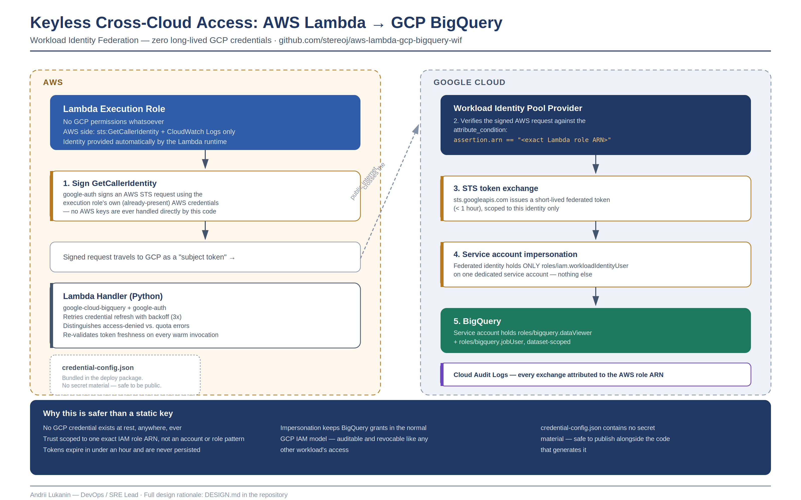

# AWS Lambda → GCP BigQuery via Workload Identity Federation

Keyless cross-cloud access: an AWS Lambda function queries Google BigQuery
without ever storing a GCP service account key. AWS's own request identity
(an IAM role, proven via STS) is federated into GCP through Workload
Identity Federation (WIF), exchanged for a short-lived, scoped access token,
and used to call BigQuery.



## Why this exists

A static GCP service account key shipped into a Lambda deployment package or
Secrets Manager is a long-lived, high-blast-radius credential: if it leaks,
it works forever, from anywhere, until someone notices and rotates it. WIF
removes that risk by design — there is no long-lived GCP credential to
leak, because none exists. Lambda's identity is proven cryptographically
per invocation and traded for a token that expires in under an hour.

Full rationale, trade-offs, and the failure modes this design guards
against are in [`DESIGN.md`](./DESIGN.md).

## How it works, in one paragraph

The Lambda execution role has no GCP permissions at all. On each cold
start, `google-auth` signs an AWS `GetCallerIdentity` request using
credentials Lambda already provides, and exchanges that signed request with
GCP's STS endpoint for a token — via a Workload Identity Pool provider that
trusts **only this exact Lambda role's ARN**. That token lets Lambda
impersonate a dedicated GCP service account, which is the identity that
actually holds `roles/bigquery.dataViewer` and `roles/bigquery.jobUser`. The
BigQuery client library then works exactly as it would anywhere else on GCP.

## Repository layout

```
.
├── DESIGN.md                          Design rationale, trade-offs, failure modes
├── terraform/
│   ├── gcp/                           Workload Identity Pool, provider, service account, BigQuery IAM
│   └── aws/                           Lambda execution role, function, log group
├── lambda/
│   ├── handler.py                     Query logic + credential handling
│   ├── requirements.txt
│   ├── credential-config.template.json   Safe to be public -- see DESIGN.md
│   └── build.sh                       Packages handler + deps + credential config into a zip
├── scripts/
│   ├── deploy.sh                      Full deploy: GCP -> credential config -> package -> AWS
│   ├── generate_credential_config.sh
│   └── smoke_test.sh                  End-to-end invoke against a real deployment
├── tests/
│   └── test_handler.py                Unit tests (mocked BigQuery client)
└── .github/workflows/ci.yml           Unit tests + terraform validate on every push
```

## Prerequisites

- Terraform >= 1.5
- AWS CLI, authenticated with permission to create IAM roles and Lambda functions
- gcloud CLI, authenticated to the target GCP project with IAM Admin
- Python 3.12 (matches the Lambda runtime) for local packaging and tests

## Quickstart

```bash
# 1. Copy and fill in variables for both stacks
cp terraform/gcp/terraform.tfvars.example terraform/gcp/terraform.tfvars
cp terraform/aws/terraform.tfvars.example terraform/aws/terraform.tfvars
# edit both files with your project ID, account ID, etc.

# 2. Run the full deploy
./scripts/deploy.sh

# 3. Confirm the trust chain end-to-end
./scripts/smoke_test.sh
```

`aws_lambda_role_arn` in `terraform/gcp/terraform.tfvars` is deterministic —
`arn:aws:iam::<account_id>:role/<function_name>-exec-role` — so it can
usually be filled in correctly before the AWS stack is ever applied. If it's
wrong on a first deploy, `terraform apply` in `terraform/gcp` again with the
ARN printed by `scripts/deploy.sh`.

## Invoking it

```bash
aws lambda invoke \
  --function-name gcp-bigquery-federated-query \
  --cli-binary-format raw-in-base64-out \
  --payload '{"sql": "SELECT * FROM `project.dataset.table` WHERE region = @region LIMIT 10", "params": {"region": "eu-west-1"}}' \
  response.json
```

## Testing

```bash
pip install -r lambda/requirements.txt pytest
pytest tests/ -v
```

Unit tests mock the BigQuery client entirely — they check the handler's
logic (parameter typing, error handling, response shape), not the live WIF
trust chain. `scripts/smoke_test.sh` is the end-to-end check against a real
deployment.

## Cleanup

```bash
cd terraform/aws && terraform destroy
cd ../gcp && terraform destroy
```

## Security model summary

- No long-lived GCP credential exists anywhere, at rest or in transit.
- The trust relationship is scoped to one exact AWS IAM role ARN, not an
  account or a role-name pattern.
- The AWS side has no GCP permissions and no direct AWS data-plane access
  beyond proving its own identity.
- BigQuery access is granted to an impersonated service account, not the
  AWS principal directly, so it's audited and revoked the same way any
  other GCP-native workload's access would be.

See [`DESIGN.md`](./DESIGN.md) for the full reasoning, including what this
deliberately doesn't cover yet.
